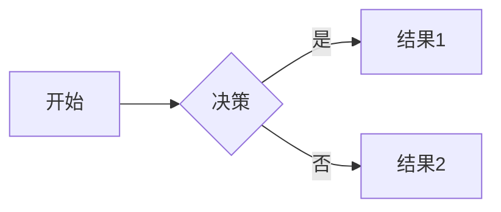

## 段落和换行

这是一个段落。  
这是一个换行。

段落之间有一个空行。

## 强调

*斜体文本*  
*斜体文本*  
**粗体文本**  
**粗体文本**  
**_ 同时斜体和粗体 _**  
~~删除线~~
===高亮===

## 列表

### 无序列表

- 项目 1
- 项目 2
  - 子项目 1
  - 子项目 2

### 有序列表

1. 第一项
2. 第二项
3. 第三项
   1. 子项 1
   2. 子项 2

## 链接

[这是一个链接](http://www.example.com)

## 链接和图片

[这是一个链接](https://www.example.com "链接标题")


## 引用

> 这是一个引用。
> 可以包含多个段落。

## 代码

`print("Hello, World!")`

```python
print("Hello, World!")
```

```json:settings.json
{
    "http.proxy": "http://127.0.0.1:端口号",
    "http.proxyStrictSSL": false
}
```

## 表格

| 表头 1 | 表头 2 | 表头 3 |
|-------|-------|-------|
| 单元格 1 | 单元格 2 | 单元格 3 |
| 单元格 4 | 单元格 5 | 单元格 6 |

### 表格扩展用法

| 左对齐 | 居中  | 右对齐 |
| :-- | :-: | --: |
| 单元格 | 单元格 | 单元格 |
| 单元格 | 单元格 | 单元格 |

## 任务列表

- [x] 已完成项
- [ ] 未完成项

## 分隔线

---

---

---

## 脚注

这是一个脚注的例子 [^1]。

## 缩写

The HTML specification is maintained by the W3C.[^2]

## HTML

<div>这是一个 HTML 元素</div>

## 特殊符号的转义

\* 星号\*

以上是 Markdown 的一些基本用法，你可以根据需要进行调整和使用。

## Mermaid

### 流程图



## 折叠内容

<details>
  <summary>点击展开/折叠</summary>
  这里是可以被折叠的内容…
</details>

## 数学公式

$$
E=mc^2
$$

## 标注

> [!INFO] 标注测试
> Here's a callout block.

## HTML 标签

<pre><kbd>Ctrl</kbd> + <kbd>S</kbd></pre>

[^1]: 这是脚注的内容。
[^2]: Web Hypertext Application Technology Working Group.
