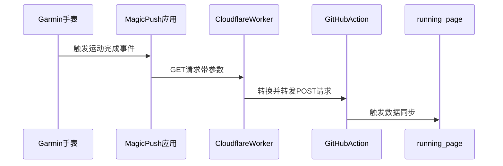

## 什么是 `running-page` ?

[running_page](https://github.com/yihong0618/running_page) 是一个开源项目，帮助用户创建个人跑步主页。它能够自动同步来自 Garmin、Nike Run Club、Strava 等运动应用的跑步数据，并通过可视化的方式展示在网页上。

## 实时同步 Garmin 运动记录

官方同步方案依赖 GitHub Action 定时触发（默认每天 1 次），如果想及时同步，可以通过 Garmin 手表应用 **Magic Push** 手动触发 Webhook 来实现与 GitHub Actions 中的工作流进行交互。

**Magic Push** 当前版本仅支持通过 GET 请求方式的 Webhook，但是 GitHub Actions 的工作流需要通过 POST 请求触发，因此我使用 Cloudflare 作为中转，将 GET 请求转换为 POST 请求。

### 实现路径



### 配置步骤

1. **MagicPush 配置**

   - 在 Connect IQ 商店下载安装 Magic Push
   - Webhook 地址格式：`https://your-worker.url/SYNC_TOKEN`

2. **配置 Cloudflare Worker**

   - 将以下代码部署到 Cloudflare Worker 中，并设置相关环境变量。

**Cloudflare Worker 代码**：

最新代码同步更新在 [gists](https://gist.github.com/viazure/6750aba76e92fcfe0e25d74f229700b1) 中。

```javascript
/**
 * @typedef {Object} Env
 */

export default {
  /**
   * @param {Request} request
   * @param {Env} env
   * @param {ExecutionContext} ctx
   * @returns {Promise<Response>}
   */
  async fetch(request, env, ctx) {
    const url = new URL(request.url);

    const sync_token = env.SYNC_TOKEN;

    if (url.pathname !== `/${sync_token}`) {
      return new Response(":(", {
        headers: { "content-type": "text/plain" },
        status: 401,
      });
    }
    const github_owener = env.GITHUB_OWENER_NAME;
    const github_repo = env.GITHUB_REPO_NAME;
    const github_token = env.GITHUB_TOKEN;
    const github_workflow_id = env.GITHUB_WORKFLOW_ID;

    const ghBody = {
      ref: "master",
    };

    const ghReq = {
      headers: {
        "Content-Type": "application/json",
        "User-Agent": `Cloudflare - ${github_owener}`,
        Authorization: `Bearer ${github_token}`,
      },
      method: "POST",
      body: JSON.stringify(ghBody),
    };

    const ghUrl = `https://api.github.com/repos/${github_owener}/${github_repo}/actions/workflows/${github_workflow_id}/dispatches`;
    const ghResp = await fetch(ghUrl, ghReq);

    if (ghResp.status !== 204) {
      console.log("Request: ", ghReq);
      console.log("Response: ", ghResp);

      return new Response(":(", {
        headers: { "content-type": "text/plain" },
        status: ghResp.status,
      });
    }

    return new Response(":)", {
      headers: { "content-type": "text/plain" },
      status: 200,
    });
  },
};
```

**环境变量说明**:

| 类型   | 名称                 | 值           | 说明                                                                                                                  |
| ------ | -------------------- | ------------ | --------------------------------------------------------------------------------------------------------------------- |
| 纯文本 | `GITHUB_OWENER_NAME` | viazure      | 仓库所有者                                                                                                            |
| 纯文本 | `GITHUB_REPO_NAME`   | running_page | running_page 项目仓库名称                                                                                             |
| 纯文本 | `GITHUB_TOKEN`       | ghp_XXX      |                                                                                                                       |
| 纯文本 | `GITHUB_WORKFLOW_ID` | XXX          | 工作流 id，获取方式参考 [shortcuts](https://github.com/yihong0618/running_page?tab=readme-ov-file#shortcuts) 示例方案 |
| 纯文本 | `SYNC_TOKEN`         | XXX          | 可以生成一个 GUID 作为密钥，避免 URL 暴露                                                                             |

## 删除错误同步的记录

在使用 running-page 的过程中，可能会遇到数据同步错误的情况，比如重复记录或错误的数据。为了处理这些问题，我总结了以下步骤：

1. **删除数据库中的记录**：使用支持 SQLite 的数据库工具（例如 DBeaver）打开 `run_page/data.db` 文件，找到并删除错误的记录。

   示例 SQL:

   ```sql
   -- 查询最近 10 条记录
   SELECT * FROM activities ORDER BY run_id DESC LIMIT 10;

   -- 删除指定记录（示例 ID）
   DELETE FROM activities WHERE run_id = '1736636014000';
   ```

2. **删除 JSON 文件中的记录**：打开 `src/static/activities.json` 文件，找到并删除对应的记录。这个文件包含了跑步活动的详细信息，删除后需要重新同步活动数据。

> [!TIP]
>
> - 建议先备份 `data.db` 和 `activities.json`
> - 保持两个数据源的记录 ID 一致
